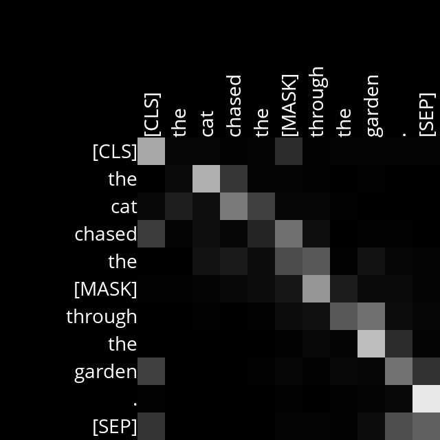
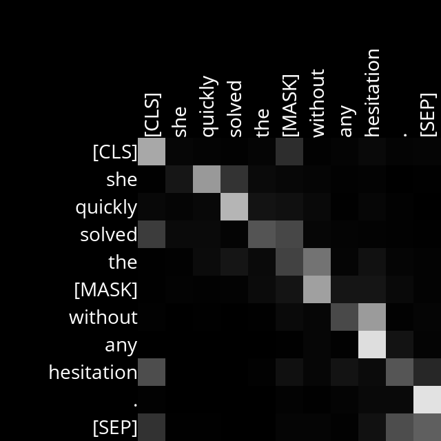
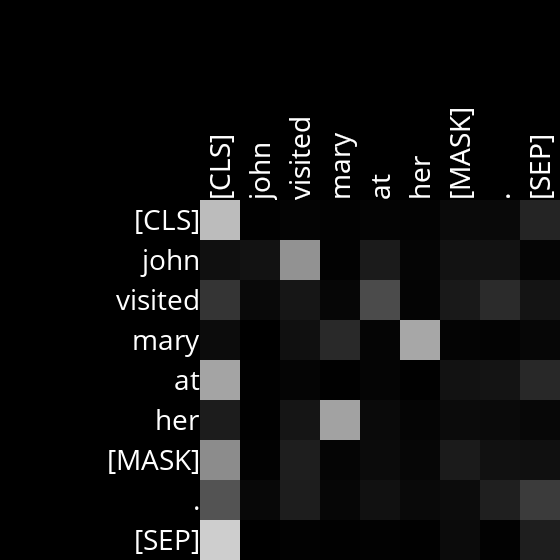
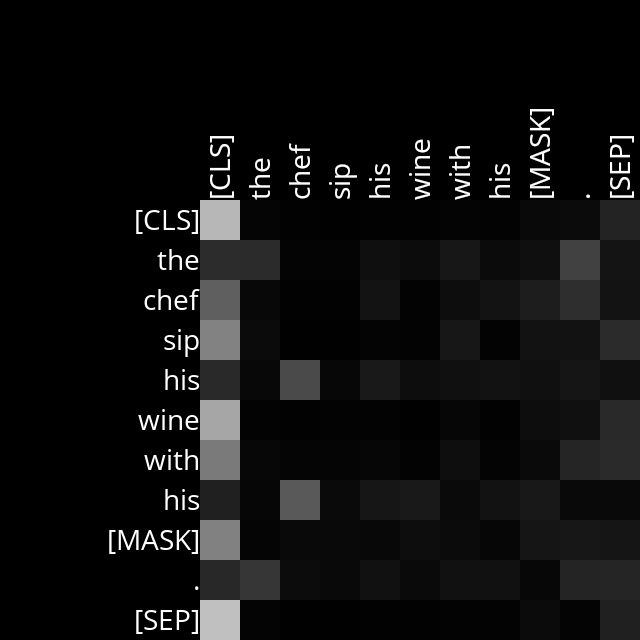

# Analysis

## Layer 1, Head 11

This attention head seems to capture the relationship between verbs and their direct objects. The attention score seemed to appoint to the influence of the verb and the direct object. It also appeared to consider the influence of the complement of the object in the main part of the direct object

Example Sentences:
- The cat chased the [MASK] through the garden.

- She quickly solved the [MASK] without any hesitation.

## Layer 3, Head 9

This attention head seems to capture the relationship between pronouns and their antecedents. Even considering the noise in the result it is clear that it pays attention to the token representing the antecedent of a pronoun, indicating an understanding of pronoun context.

Example Sentences:
- John visited Mary at her [MASK].

- The chef sip his wine with his [MASK].

